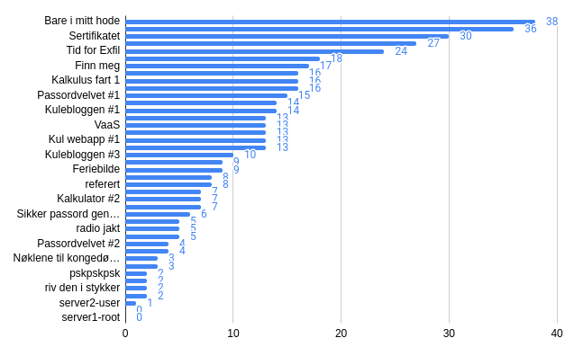
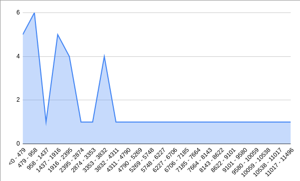
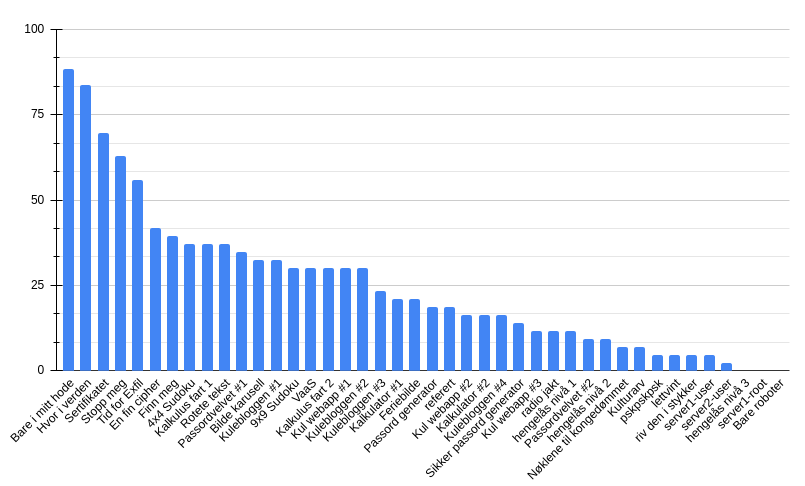
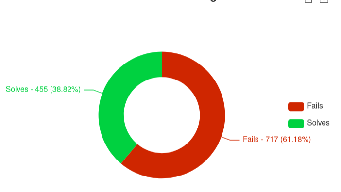
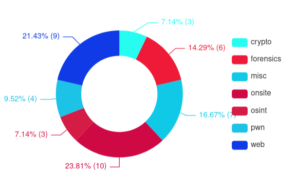

# Sikkerhetsdagen CTF 2022

- **110** users registered
- **62** teams registered
- **1** IP addresses <!-- We only saw ip from big ip box ;_; so sad -->
- **20138** total possible points
- **42** challenges
- **Bare i mitt hode** has the most solves with 38 solves
- **server2-user** has the least solves with 1 solves

## Teams
### Onsite
  | Site Place | Place | NAME           | SCORE |
  | ---------- | ----- | -------------- | ----- |
  | 1          | 1     | **give cake**  | 16630 |
  | 2          | 7     | **farmår**     | 12656 |
  | 3          | 8     | **Bærtur**     | 10650 |
  | 4          | 12    | WhatTheShell?  | 7679  |
  | 5          | 13    | Sasha Grey     | 6706  |
  | 6          | 15    | Ompalompas     | 5778  |
  | 7          | 17    | Script kiddies | 3769  |
  | 8          | 28    | Stukes         | 1807  |

### Offsite
  | Site Place | Place | NAME              | SCORE |
  | ---------- | ----- | ----------------- | ----- |
  | 1          | 2     | EPT               | 15138 |
  | 2          | 3     | coldboots         | 15138 |
  | 3          | 4     | Corax             | 15138 |
  | 4          | 5     | RumbleInTheJungle | 13638 |
  | 5          | 6     | hag               | 13141 |
  | 6          | 9     | vidarino          | 10170 |
  | 7          | 10    | Horten kommune    | 8668  |
  | 8          | 11    | bootplug          | 8169  |
  | 9          | 14    | Dcaz              | 6201  |
  | 10         | 16    | EselService       | 4719  |

### Top Users
| Place | User       | Score |
| ----- | ---------- | ----- |
| 1     | coldboots  | 15138 |
| 2     | hag        | 13141 |
| 3     | vidarino   | 10170 |
| 4     | fjellape   | 8784  |
| 5     | decoy      | 7372  |
| 6     | langemyh   | 7293  |
| 7     | vcpo       | 6874  |
| 8     | shotscape  | 6791  |
| 9     | Sasha Grey | 6706  |
| 10    | Dcaz       | 6201  |

### Solve Counts

### Score Distribution

### Solve Percentages per Challenge

### Submission Percentages

- **455** right submissions
- **717** wrong submissions

### Category Breakdown

