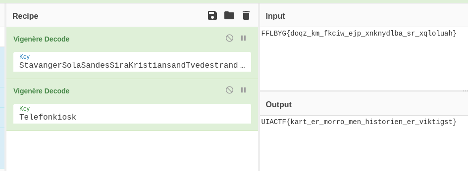

# Taskname
> Author: Mx. Task

## Solution
Det hintes til i oppgaven at en er på jakt etter byer og en nostalgisk kulturarv. Uten å være alt for kryptisk så ligger det en liste med byer med oppgaven.

Her skal en da gå gjennom alle byene og da finne, navnet på byen. Samtidigt se seg rundt for å se hva er det som alle byene har til felles. Dette er da de Røde Telefonkioskene. (https://telenorkulturarv.no/telefonkioskene)

---

Deretter har en alt fått en encodet streng i oppgaven som går som følger ``FFLBYG{doqz_km_fkciw_ejp_xnknydlba_sr_xqloluah}``

For å gå frem for å decode denne så bruker en alle sitt favoritt verktøy, Cyberchef.

Siden vi alt har fått en encodet streng så må vi bruke vigenere cipher, for å finne løsningen til flagget.

Siden det også var et hint om at 2FA er viktigt, så kan vi prøve oss på å bruke 2 vigenere cipher encodinger.

Hvor den ene inneholder en liste av alle byene og den andre inneholder strengen **"Telefonkiosk"**
1. ``StavangerSolaSandesSiraKristiansandTvedestrandRisorJomfrulandSkienSandefjordTjome``
2. ``Telefonkiosk``

 
<!-- Ja, det ble Sandes og ikke Sandnes. Fort gjort.  -->

Da får en flagget: ``UIACTF{kart_er_morro_men_historien_er_viktigst}``

